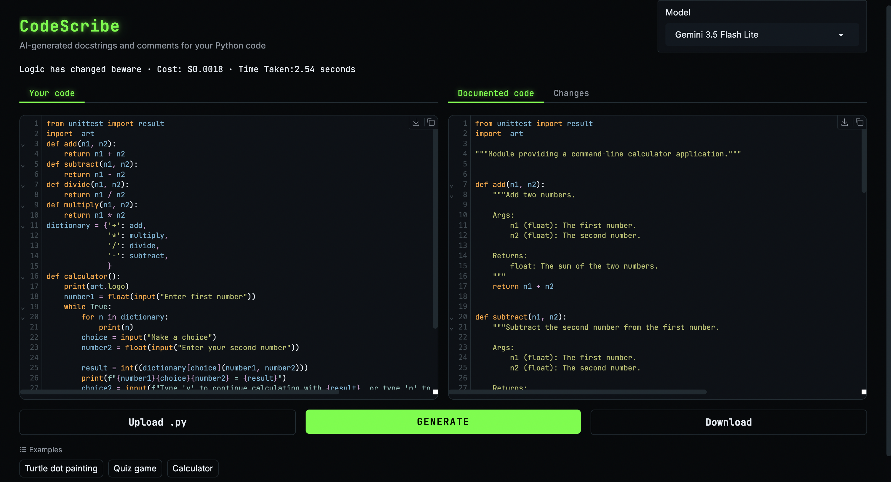

# CodeScribe

**AI-generated docstrings and comments for your Python code, with automatic proof that your logic wasn't changed.**




---

## Purpose

Writing documentation is one of the most skipped steps in programming. CodeScribe takes undocumented Python code and returns the same code with clear, consistent **Google-style docstrings** and **inline comments** explaining the non-obvious parts.

The key problem with using an LLM for this is trust: models sometimes "helpfully" rewrite code they were only asked to document. CodeScribe addresses this directly. Every output is **automatically checked to confirm the program's logic is unchanged**, and every change is shown in a line-by-line diff, so you never have to take the model's word for it.

---


## Features


### Documentation

- **Google-style docstrings** for modules, classes, functions and methods, including `Args`, `Returns` and `Raises` sections
- **Inline comments** that explain *why* code works the way it does, not just *what* each line does
- **Bug flagging**: likely bugs are marked with a `# NOTE: possible issue` comment rather than silently fixed


### Verification

- **Logic check**: the original and documented code are both parsed into Abstract Syntax Trees (using Python's `ast` module), docstrings are removed, and the trees are compared. If anything other than documentation changed, the app warns you
- **Diff view**: a *Changes* tab highlights every added line in green and any removed line in red


### Model comparison

- **Six models** selectable from a dropdown, all accessed through a single OpenRouter client
- **Cost per request**, calculated from the token counts returned by the API
- **Response time** for each request


### Usability

- **Streaming output**: documentation appears as it is written, instead of after a long pause
- **Upload and download**: document a `.py` file directly and download the result
- **Built-in examples**: try the tool in one click without supplying your own code
- **Custom dark theme** with neon-green accents

---


## How it works

```
Your code ──► Prompt builder ──► LLM (via OpenRouter, streamed)
                                          │
                                          ▼
                                   Clean response
                                          │
                     ┌────────────────────┼────────────────────┐
                     ▼                    ▼                    ▼
               Logic check           Diff view           Cost & timing
            (AST comparison)        (difflib)          (token usage)
```

1. **Prompting.** A detailed system prompt defines the docstring format, the commenting style, and one absolute rule: *do not change the code*. The user's code is passed inside delimiters so the model cannot confuse it with instructions.
2. **Generation.** The request is sent to the chosen model with `temperature=0` for consistent, deterministic output, and the response is streamed to the interface.
3. **Cleaning.** Any markdown code fences the model adds are stripped from the response.
4. **Verification.** The original and documented code are compared as syntax trees, and a line-level diff is produced.
5. **Reporting.** The status line shows the logic check result, the cost and the time taken.

---


## Supported models


| Model                 | OpenRouter ID                  |
| --------------------- | ------------------------------ |
| Qwen 3.8 Flash        | `qwen/qwen3.8-flash`           |
| GPT-5.6 Luna          | `openai/gpt-5.6-luna`          |
| Gemini 3.5 Flash Lite | `google/gemini-3.5-flash-lite` |
| Gemini 3.8 Flash      | `google/gemini-3.8-flash`      |
| Grok 4.3              | `x-ai/grok-4.3`                |
| Claude Sonnet 5       | `anthropic/claude-sonnet-5`    |


Adding a model only requires a new entry in the `MODELS` and `PRICES` dictionaries in `app.py`. Prices are set per million tokens and should be checked against [OpenRouter's model pages](https://openrouter.ai/models), as they change over time.

---


## Getting started


### Prerequisites

- Python 3.10 or later
- An [OpenRouter](https://openrouter.ai) account and API key


### Installation

```bash
# Clone the repository
git clone https://github.com/MatthewGilham/codescribe.git
cd codescribe

# Create and activate a virtual environment
python3 -m venv .venv
source .venv/bin/activate        # On Windows: .venv\Scripts\activate

# Install dependencies
pip install -r requirements.txt
```


### Configuration

Copy the example environment file and add your OpenRouter API key:

```bash
cp .env.example .env
```

Then open `.env` and replace the placeholder with your key. The `.env` file is listed in `.gitignore`, so your key is never committed.

### Run

```bash
python app.py
```

The app opens in your browser at `http://127.0.0.1:7860`.

---


## Usage

1. Choose a model from the **Model** dropdown.
2. Paste code into **Your code**, upload a `.py` file, or click one of the **Examples**.
3. Click **Generate**.
4. Review the result in **Documented code**, and check the **Changes** tab to see exactly what was added.
5. Confirm the status line reads **Logic Identical**, then click **Download** to save the documented file.

---


## Project structure

```
codescribe/
├── app.py              # Gradio interface, generation, logic check, diff and cost tracking
├── prompts.py          # System and user prompts, and the message builder
├── theme.py            # Custom Gradio theme and CSS
├── examples/           # Sample Python files used by the built-in examples
├── requirements.txt    # Python dependencies
└── .env.example        # Template for the API key
```

---


## Limitations

- **Single files only.** Each request documents one file in isolation, so the model has no knowledge of code in other files.
- **Model quality varies.** Smaller models sometimes break formatting rules (for example, adding a `Returns: None` section) or miss bugs. The logic check catches changes to code, but not the quality of the documentation itself.
- **Bug flagging depends on the model.** A `# NOTE` comment is a prompt for review, not a guarantee that every bug has been found.
- **Cost figures are estimates**, based on the prices set in `app.py`.

---


## Built with

- [Python](https://www.python.org/)
- [Gradio](https://www.gradio.app/): web interface
- [OpenAI Python SDK](https://github.com/openai/openai-python): API client, pointed at OpenRouter
- [OpenRouter](https://openrouter.ai/): unified access to multiple LLM providers
- Python's built-in `ast` and `difflib` modules: logic verification and diffing

